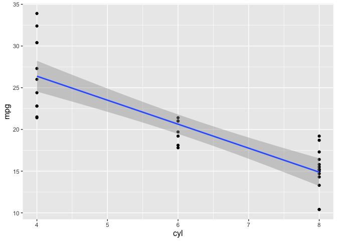

<!-- README.md is generated from README.Rmd. Please edit that file -->

# modelGraph

<!-- badges: start -->

<!-- badges: end -->

The goal of modelGraph is to provide a ggplot modelling numeric
datasets.

## Installation

You can install the released version of modelGraph from
[CRAN](https://CRAN.R-project.org) with:

``` r
devtools::install_github("georgewangyu/modelGraph")
```

## Example

This is a basic example which shows you how to solve a common problem:

``` r
library(modelGraph)
plot_modelgraph(mtcars, cyl, mpg, model_type = "lm")
#> `geom_smooth()` using formula 'y ~ x'
```



What is special about using `README.Rmd` instead of just `README.md`?
You can include R chunks like so:

``` r
summary(cars)
#>      speed           dist       
#>  Min.   : 4.0   Min.   :  2.00  
#>  1st Qu.:12.0   1st Qu.: 26.00  
#>  Median :15.0   Median : 36.00  
#>  Mean   :15.4   Mean   : 42.98  
#>  3rd Qu.:19.0   3rd Qu.: 56.00  
#>  Max.   :25.0   Max.   :120.00
```

You’ll still need to render `README.Rmd` regularly, to keep `README.md`
up-to-date.

You can also embed plots, for example:


## This is what I did to create my R package:

### Steps that I took to create an R package and commit as git repository:

1.  Loading devtools in the console (this must be done every time the
    console restarts), using library(devtools).
2.  Ran create\_package(“\~/RStudio STAT 545/modelGraph”)
3.  Ran use\_git() to create git repository
4.  In RStudio, went to Tools \> Project Options … \> Git/SVN. Under
    “Version control system”, select “Git” and confirmed yes.
5.  Ran git init in console.
6.  Committed the project.

### Linking to Github Repository:

1.  Ran use\_github() and confirmed selections

### Creating an R package with functions:

1.  Turned my function from assignment 1-B into an R package.
2.  use\_r(“modelGraph”) and modified file by adding the function.
3.  Tried the function by testing on the console.
4.  Tested function by using load\_all().
5.  Clicked on check to ensure that the package was still intact.

### Editing Description file:

1.  Added license via console: use\_mit\_license(“George Wang”).

### Running Roxygen skeleton:

1.  Used “Code \> Insert roxygen skeleton” and then added appropriate
    names, parameters, export, then ran document().
2.  Ran install().

### Creating tests:

1.  Ran use\_testthat() and then manually added my tests for the
    function.
2.  Manually changed the functions to include dplyr::, ggplot2::, gap
    minder:: for all associated functions and datasets for dependencies
3.  Indicated dependency using use\_package(“gapminder”),
    use\_package(“dplyr”), use\_package(“ggplot2”)

### Adding and editing readme file:

1.  Add a package README with use\_readme\_rmd()
2.  Edited manually to included further information.
3.  Added line on installation: other people can install the package
    with devtools::install\_github(“your\_username/package\_name”)

### Creating a vignette:

4.  Made a vignette using use\_vignette().

### Checked all functions and tests are still working before knitting readme file with build\_readme().

## Code of Conduct

Please note that the modelGraph project is released with a [Contributor
Code of
Conduct](https://contributor-covenant.org/version/2/0/CODE_OF_CONDUCT.html).
By contributing to this project, you agree to abide by its terms.
